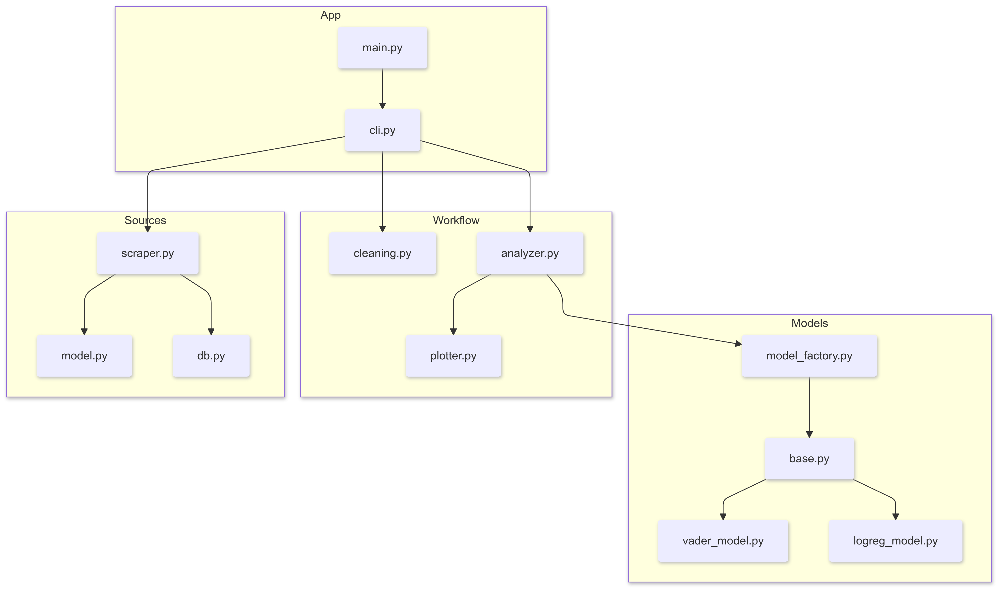

# Project Overview
This project is a sentiment analysis pipeline for movie reviews, structured into four main modules:

- **app**: Contains the CLI interface (`cli.py`) and entry point (`main.py`) for the application. The CLI tool provides commands for scraping reviews, cleaning data, and analyzing sentiment.

- **models**: Implements two sentiment analysis approaches:
  - VADER: Rule-based sentiment scoring using the VADER library
  - Logistic Regression: Machine learning model trained on movie reviews
  - Common interface defined in `base.py` for consistent model usage

- **workflow**: Handles the processing pipeline:
  - `cleaning.py`: Text preprocessing including emoji handling, language detection, and lemmatization
  - `plotter.py`: Visualization tools for sentiment distributions and score comparisons
  - `analyzer.py`: Core sentiment analysis logic and result aggregation

- **sources/letterboxd**: Manages data collection:
  - `scraper.py`: Asynchronous review scraping from Letterboxd
  - `model.py`: Review data structure
  - `db.py`: CSV storage handling

The CLI tool (`senti`) provides a simple interface to this functionality:
- `scrape`: Collect reviews from Letterboxd
- `clean`: Preprocess and normalize review text
- `analyze`: Run sentiment analysis with visualization options

## Model Training & Evaluation

The notebooks demonstrate:
- Feature extraction and preprocessing
- Model training and evaluation
- Performance comparison between approaches
- Visualization and analysis of results

Each notebook contains detailed comments and markdown cells explaining the implementation details and analysis results. The trained models are saved to the `assets/models` directory for use in production.

The logistic regression model shows superior performance for this specific task of movie review sentiment analysis, likely due to being trained on domain-specific data.

Analysis notebooks are located in the `notebooks` directory:

### [logistic_regression_train.ipynb](./notebooks/logistic_regression_train.ipynb)
Training notebook for the logistic regression model that includes: 
- TF-IDF vectorization
- Model training and evaluation

### [vader.ipynb](./notebooks/vader.ipynb)
VADER sentiment analysis baseline that includes:
- VADER sentiment analysis on IMDb dataset
- Performance evaluation and metrics
- Comparison visualizations

### [logistic_regression_train.ipynb](./notebooks/logistic_regression_train.ipynb)
- Model saving for production use (No additional documentation)

## Features
- Asynchronous review scraping from Letterboxd
- Text preprocessing and cleaning
- Multiple sentiment analysis models:
  - VADER (rule-based)
  - Logistic Regression (trained on movie reviews)
- Visualization options:
  - Sentiment distribution
  - Score comparison
  - Average scores
- JSON and CSV output formats
- Progress tracking and error handling

## Architecture


## Installation

```bash
# Clone repository
git clone https://github.com/njdimmer/Projektarbeit.git

# Install dependencies
pip install -r requirements.txt
```
## Usage
Activate Venv:
```sh
python -m venv .venv
```
### Windows
```ps1
# Using batch script
.\senti.bat --help
```
### Directly with Python
```sh
python -m sentiment_analysis.app.main --help
```

## CLI Commands

### Scrape Reviews
```bash
# Basic scraping
senti scrape wicked-2024

# Scrape and clean immediately
senti scrape wicked-2024 --clean
```
### Clean Data
```sh
# Clean scraped reviews
senti clean out/db/letterboxd/raw/wicked-2024.csv
```
### Analyze Sentiment
```sh
# Single text analysis
senti analyze --text "Great movie!"

# Analyze CSV with VADER
senti analyze --csv out/db/letterboxd/clean/wicked-2024.csv --model vader

# Analyze with LogReg and plots
senti analyze --csv out/db/letterboxd/clean/wicked-2024.csv --model logreg --graph all

# Available graph options:
# - distribution: Show sentiment distribution
# - comparison: Compare review vs sentiment scores
# - averages: Show average sentiment scores
# - all: Display all plots

# Save plots to custom directory
senti analyze --csv input.csv --graph all --output custom/path

# Output as JSONL
senti analyze --csv input.csv --jsonl
```
### Common Options
```sh
--help          Show help message
--version       Show version information
```
## Output Directory Structure
```
out/
├── db/
│   └── letterboxd/
│       ├── raw/       # Raw scraped reviews
│       └── clean/     # Preprocessed reviews
└── plots/            # Generated visualizations
```
## Dependencies
- typer: CLI interface
- aiohttp: Async HTTP requests
- beautifulsoup4: HTML parsing
- vaderSentiment: VADER analyzer
- scikit-learn: Logistic regression
- matplotlib/seaborn: Plotting
- pandas: Data handling